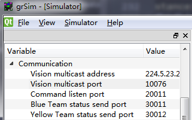
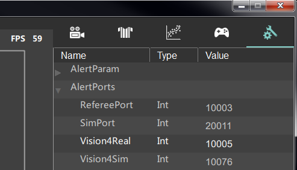

## About Athena & grSim
* [grSim](https://github.com/RoboCup-SSL/grSim) is a simulation software. It will send information(robot position and orientation) via [UDP](https://baike.baidu.com/item/UDP/571511?fr=aladdin) like a real [vision machine](https://github.com/RoboCup-SSL/ssl-vision) which will be used in real robot situation.
* Athena is a visualization software, receiving data from grSim or vision machine, sending information(robot position & orientation & velocity & angular velocity) via UDP.

| Item          | Multicast Address | Port                             |
| ------------- | ----------------- | -------------------------------- |
| Athena Output | Localhost         | 23333,23334                      |
| Athena Input  | 224.5.23.2        | real:10005,sim:10076(modifiable) |
| grSim Output  | 224.5.23.2        | 10076(modifiable)                |
| grSim Input   | Localhost         | 20011                            |

#### Post setting
**grSim:**

**Athena:(Press 'R' to reload)**

## Python
#### How to use
1.Open Athena and grSim
2.Connect Athena to grSim
3.run script: python/test_run.py

#### Python Protobuf Tutorials
[Developer Guide](https://developers.google.com/protocol-buffers/docs/pythontutorial)